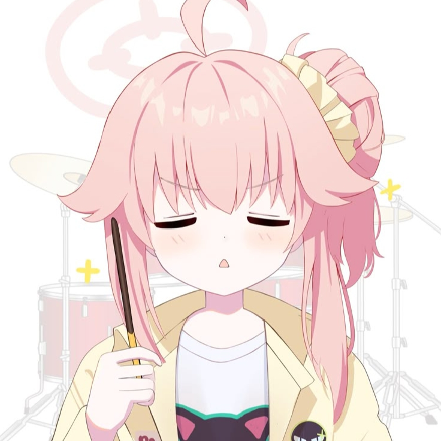
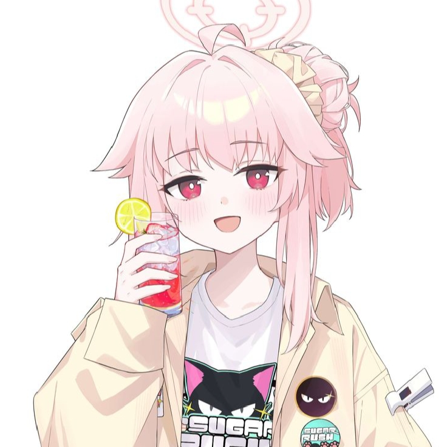

<h3 align="center">Hello, I'm Abu Kentucky 👋</h3>

<i>"Ingin menjadi programmer handal, namun enggan mengoding"</i>

  
  

**🧠 About Me**

- 🧑‍💻 Full-time **anime enjoyer**, part-time **coding**
- 🧪 Learning `TypeScript` want to try making a bot 
- 🎯 focus on: `JavaScript`, `Python`, `HTML/CSS`

**🔧 Tech Stack**

  
  
  
  
  
  

**☕ Hobbies**

- 📚 reading manga
- 📺 watching anime
- 🧠 scroll fesbuk

**❤️ My Wife**

<table>
  <tr>
    <td align="center">
       
    </td>
    <td align="center">
       
    </td>
    <td align="center">
       
    </td>
  </tr>
</table>

**📊 GitHub Stats**

  

**☕ Cihuyy**
> _"Ketika kode error, mending scroll fesbuk."_ – **Abu Kentucky**
